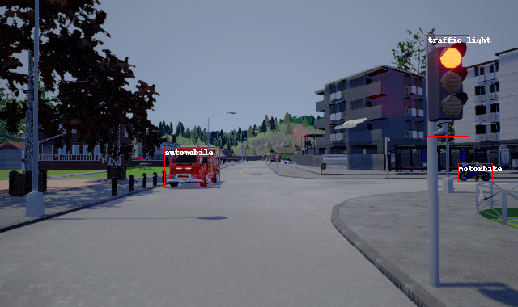

# Carla-COCO-Object-Detection-Dataset

**COCO-Style Labelled Dataset for Object Detection in Carla Simulator**

This dataset contains 1028 images each 640x380 pixels.
The dataset is split into 249 test and 779 training examples.
Every image comes with an associated label .xml file in the pascal VOC format ([`./labels/`](labels) folder).
A MS COCO format of the dataset is available in the [`./train.json`](train.json) and [`./test.json`](test.json) files.
The dataset was collected in Carla Simulator, driving around in autopilot mode in various environments (Town01, Town02, Town03, Town04, Town05) and saving every i-th frame.
The labels where then automatically generated using the semantic segmentation information.

**Available classes are:**

* Automobile (Car, Truck)
* Bike
* Motorbike
* Traffic light
* Traffic sign

**Example image:**

**Example annotated image:**

## Changelog

### 2023-11-29

#### Changed

* Recreated dataset in monolythic MS COCO format
  * Removed yolo format
  * Updated README
  * Added image URLs

## Contributions
This repo is a fork from [Carla-Object-Detection-Dataset](https://github.com/DanielHfnr/Carla-Object-Detection-Dataset).
Acknowledgements are made to [DanielHfnr](https://github.com/DanielHfnr) for the original data collection and dataset preparation.
